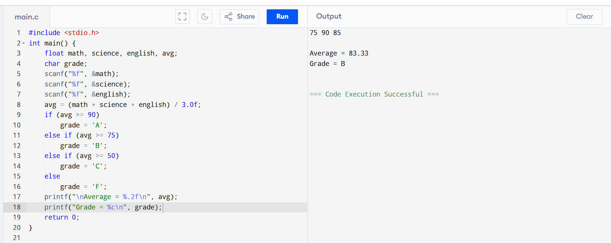
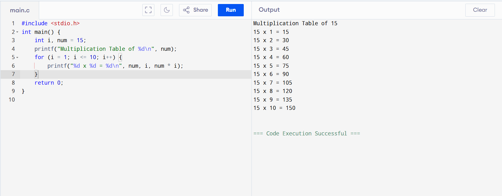
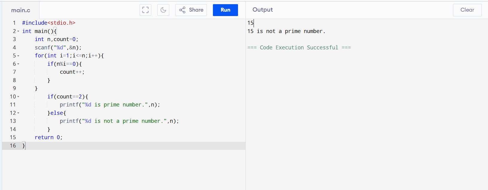
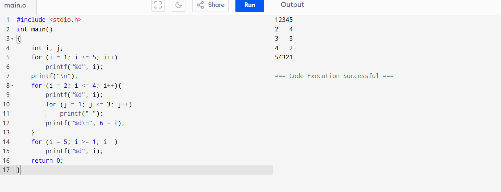
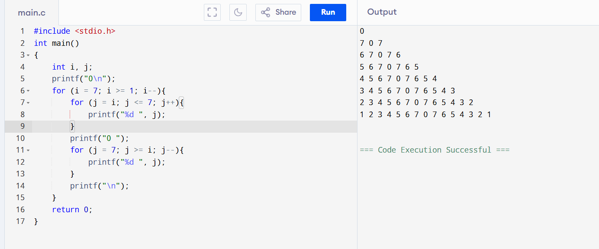

# 19AI304-Fundamentals-of-C-Programming-2025-Odd-M2
# IAPR-2- Module 2 - FoC
## 3. Implementation of programs using conditional statements.
## 4. Implementation of programs using various control statements.
# Ex.No:6
  Build a C program to input a student’s marks in three subjects (Math, Science, and English). Calculate the average marks and determine the grade using nested if-else statements with safe floating-point comparisons based on the following grading criteria:
    
  A: 90 and above
  
  B: 75 to 89.99
  
  C: 50 to 74.99
  
  F: below 50
  
  The program should display the average marks up to two decimal places and the corresponding grade. 
  
# Date : 
# Aim:
 To build a C program that receives inputs for a student’s marks in three subjects, calculates the average, and determines the grade using nested if-else statements with safe floating-point comparisons.
# Algorithm:
### Step 1:
  Start
### Step 2: 
  Include the standard input-output library: #include<stdio.h>.
### Step 3: 
  Declare float variables math, science, english to store marks of each subject.
### Step 4: 
  Declare a float variable average to store the average marks.
### Step 5: 
  Prompt the user to enter marks for Math, Science, and English.
### Step 6: 
  Read the input marks.
### Step 7: 
  Calculate the average marks using the formula:
   
  average=(math + science + english​)/3.0f
### Step 8: 
  Check if average is greater than or equal to 90.0f

  If yes, print Grade A.

  Else, proceed to Step 9.  
### Step 9:
  Check if average is greater than or equal to 75.0f

  If yes, print Grade B.

  Else, proceed to Step 10.
### Step 10:
  Check if average is greater than or equal to 50.0f

  If yes, print Grade C.

  Else, print Grade F.
### Step 11:
  Stop
# Program:
```
#include <stdio.h>
int main() {
    float math, science, english, avg;
    char grade;
    scanf("%f", &math);
    scanf("%f", &science);
    scanf("%f", &english);
    avg = (math + science + english) / 3.0f;
    if (avg >= 90)
        grade = 'A';
    else if (avg >= 75)
        grade = 'B';
    else if (avg >= 50)
        grade = 'C';
    else
        grade = 'F';
    printf("\nAverage = %.2f\n", avg);
    printf("Grade = %c\n", grade);
    return 0;
}
```
# Output:

# Result: 
Thus, the program was implemented and executed successfully, and the required output was obtained.

# 19AI304-Fundamentals-of-C-Programming-2025-Odd-M2
# IAPR-2- Module 2 - FoC
# Ex.No:7
  Develop a C program to display the multiplication table of a given number (15) up to 10.
# Date : 
# Aim:
 To develop a C program that prints the multiplication table of the number 15 up to 10 using a for loop.
# Algorithm:
### Step 1:
  Start
### Step 2: 
  Include the standard input-output library: #include<stdio.h>.
### Step 3: 
  Declare an integer variable number and initialize it with 15.
### Step 4: 
  Declare another integer variable i to use as a loop counter.
### Step 5: 
  Use a for loop to iterate from i = 1 to i = 10.
  
  In each iteration:
  
  a. Multiply number by i.
  
  b. Print the result in the format: number x i = result.
### Step 6: 
  Stop

# Program:
```
#include <stdio.h>
int main() {
    int i, num = 15;
    printf("Multiplication Table of %d\n", num);
    for (i = 1; i <= 10; i++) {
        printf("%d x %d = %d\n", num, i, num * i);
    }
    return 0;
}
```
# Output:

# Result: 
Thus, the program was implemented and executed successfully, and the required output was obtained.

# 19AI304-Fundamentals-of-C-Programming-2025-Odd-M2
# IAPR-2- Module 2 - FoC
# Ex.No:8
  Develop a C program to check whether a given number is prime or not.
# Date : 
# Aim:
 To develop a C program that determines whether an input number is a prime number using a while loop.
# Algorithm:
### Step 1:
  Start
### Step 2: 
  Include the standard input-output library: #include<stdio.h>.
### Step 3: 
  Declare integer variables:
  
  n to store the number entered by the user.
  
  i to use as a counter (initialize to 2).
  
  f as a flag to indicate whether the number is divisible (initialize to 0).
### Step 4: 
  Read the value of n from the user.
### Step 5: 
  Use a while loop to iterate while i <= n-1:
  
  Check if n % i == 0:

  If yes, set f = 1 (number is not prime) and break the loop.
  
  Increment i by 1.
### Step 6: 
  After the loop:
  
  If f == 0, print that the number is prime.
  
  Else, print that the number is not prime.
### Step 7:   
  Stop
# Program:
```
#include<stdio.h>
int main(){
    int n,count=0;
    scanf("%d",&n);
    for(int i=1;i<=n;i++){
        if(n%i==0){
            count++;
        }
    }
        if(count==2){
            printf("%d is prime number.",n);
        }else{
            printf("%d is not a prime number.",n);
        }
    return 0;
}
```
# Output:

# Result: 
Thus, the program was implemented and executed successfully, and the required output was obtained.


# 19AI304-Fundamentals-of-C-Programming-2025-Odd-M2
# IAPR-2- Module 2 - FoC
# Ex.No:9
  Generate the C code to display the pattern below.  
 ``` 
 12345  
 2   4  
 3   3  
 4   2  
 54321
 ```
# Date : 
# Aim:
 To build a C program that prints the required numeric pattern for a given value of n using nested loops.
# Algorithm:
### Step 1:
  Start
### Step 2: 
  Include the standard input-output library: #include<stdio.h>.
### Step 3: 
  Declare variables i, j, n, and k.
### Step 4: 
  Read the value of n from the user.
### Step 5: 
  Set i = 1.
### Step 6:  
  Repeat the following steps until i > n:
  
  Step 6.1: For j from i to n, print j if i == 1 or j == i, otherwise print a space.
  
  Step 6.2: Set k = j - 2.
  
  Step 6.3: For j from 1 to i - 1, print k if i == n or j == i - 1, otherwise print a space.
  
  Step 6.4: Decrease k after each print.
  
  Step 6.5: Move to the next line.
  
### Step 7: 
  Increase i and repeat Step 6.
### Step 8:   
  Stop
# Program:
```
#include <stdio.h>
int main()
{
    int i, j;
    for (i = 1; i <= 5; i++)
        printf("%d", i);
    printf("\n");
    for (i = 2; i <= 4; i++){
        printf("%d", i);
        for (j = 1; j <= 3; j++)
            printf(" ");
        printf("%d\n", 6 - i);
    }
    for (i = 5; i >= 1; i--)
        printf("%d", i);
    return 0;
}
```
# Output:

# Result: 
  Thus, the program was implemented and executed successfully, and the required output was obtained.

  
# 19AI304-Fundamentals-of-C-Programming-2025-Odd-M2
# IAPR-2- Module 2 - FoC
# Ex.No:10
  Generate the C code to display the pattern below.  
  
 0
 
 7  0  7
 
 6  7  0  7  6
 
 5  6  7  0  7  6  5
 
 4  5  6  7  0  7  6  5  4
 
 3  4  5  6  7  0  7  6  5  4  3
 
 2  3  4  5  6  7  0  7  6  5  4  3  2
 
 1  2  3  4  5  6  7  0  7  6  5  4  3  2  1

# Aim: 
  To formulate a C program to print a symmetric numeric pattern in which each row contains an increasing sequence of numbers from the row value up to 7, followed by 0 in the center, and then a decreasing sequence of numbers back to the row value.
# Algorithm:
### Step 1:
  Start
### Step 2: 
  Include the standard input-output library: #include<stdio.h>.
### Step 3: 
  Declare integer variables i and j.
### Step 4: 
  Print 0 on the first line.
### Step 5:
  Set i = 7.
### Step 6:
   Repeat Steps 6.1 to 6.4 while `i >= 1`:

   Step 6.1: For `j = i` to `7`, print `j`.

   Step 6.2: Print `0` in the center.

   Step 6.3: For `j = 7` down to `i`, print `j`.

   Step 6.4: Move to the next line.
### Step 7:
  Decrease i by 1 and go back to Step 6.
### Step 8:
  Stop
# program:
```
#include <stdio.h>
int main()
{
    int i, j;
    printf("0\n");
    for (i = 7; i >= 1; i--){
        for (j = i; j <= 7; j++){
            printf("%d ", j);
        }
        printf("0 ");
        for (j = 7; j >= i; j--){
            printf("%d ", j);
        }
        printf("\n");
    }
    return 0;
}
```
# output:

# Result:
  Thus, the program was implemented and executed successfully, and the required output was obtained.

